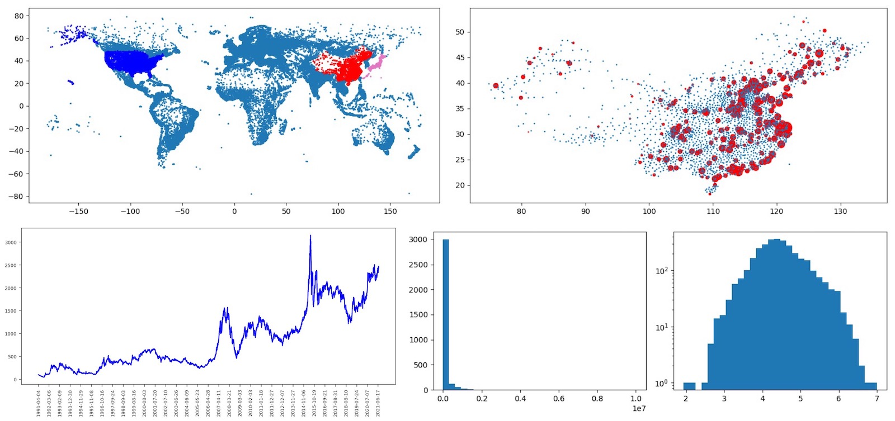

# Quick SQLite Cmd/Script Tools

## Qsqlite 介绍
- 一个**命令行工具**，可通过交互方式来操作 sqlite 或 mysql 数据库, 快速实现数据处理、分析、统计、图形展示工作;
  - 常规 sqlite 操作（类似于 sqlite 提供的命令行工具); 可以方便的使用 sql 语句进行操作.
  - 支持 sqlite 及 sqlite 内存数据库(:memory:)、支持mysql数据库、将整个mysql数据库复制到sqlite、sqlite 不同数据库间表的复制操作.
  - 加载 csv/tsv 或 json 数据，或将 select 结果输出到 csv/tsv 文件.
  - 用 select 语句获取的数据绘制图形，例如：散点图、折线图、直方图(分布)、小提琴图(基于数据分布).
  - 提供系列扩展的 sqlite 函数，支持 正则操作、基于文本的sum操作、中国身份证识别等扩展功能.
- 一个**脚本解释器**，可以通过编写脚本文件，批量、自动化执行系列操作，实现数据处理、分析、报表输出工作;
  - 提供基于 sql 语句的脚本功能，让你能将批量操作自动完成，并且将结果输出到一个 html 文件.
  - 支持扩展的 loop/lend 带嵌套支持的循环语句, 便于实现一些 sql 语句无法处理的操作需求.
  - 支持对 select 结果进行格式化输出的语法，便于生成格式化的报表.
  - 输出的 html 文件中，图形将以内嵌的形式保存，使得只需要发送单一 html 文件就能完整展示所有图表内容.
- 一个**Web服务器** 和 **Job服务器**，可基于数据库提供 web 或 定时任务 处理后台服务;
  - Web 服务器可通过脚本定义来实现数据查询，数据插入操作，便于将数据统计、分析结果以 浏览器 方式实现交互.
  - Job 服务器可通过脚本定义来实现定时的数据清理、数据汇总、分析、报表生成，并且以本地文件输出，或发送邮件方式分享结果.
- 一个**Python库**, 通过 from Qsqlite import Qexec 导入, 在 python 或 ipynb jupyter/ipython notebook 中使用 Qexec(cmds) 调用, cmds 可以是一个带换行符的字符串，包括系列的命令 或 一个指令.
- **总结**: 借助 sqlite 强大的 sql 语法功能 和 高性能的表现，Qsqlite希望能让你**高效**的发挥 sqlite 和 sql语法 的能力，快速实现数据的整理、分析、统计、展示工作；并在需要时可通过导出/导入 csv/tsv 文件和 Excel 进行协同工作，实现更高效率。



## 快速使用
1. 安装
  - 使用 pip install qsqlite 安装; 而后输入 Qsqlite 运行; 
  - 或将 Qsqlite.py 复制到本地, 而后在 命令行/终端 下运行 python Qsqlite.py (请确认使用 python3 环境运行)
2. 现在你可以输入 sql 指令或输入 ? 来获取帮助信息，或者尝试将下面指令复制进去运行测试一下
```sql
  # 打开一个内存数据库
  open :memory:
  # 创建 demo 表
  create table demo(ID text, Name text, Age integer)
  # 利用 loop/lend 循环插入数据
  loop [ [i, i**2] for i in range(1,100) ]
  insert into demo values ('_^1_', 'User_^1_', _^2_)
  lend
  # 输出数据
  info
  select count(*) from demo 
  select * from demo limit 10 >[- ID: _@1_, Name: _@2_, Age: _@3_]
  # 绘制图形
  draw l select age from demo; draw ll select id,age from demo
```
3. 可尝试运行 demo 目录下的 演示脚本 文件, 使用 python3 Qsqlite.py 脚本文件名 来运行
  - qloop.txt   loop/lend功能演示
  - qdraw.txt   html输出及绘图功能演示 （需使用 demo 目录下两个 csv 文件)
  - qweb.txt    Web服务器功能演示
  - qjob.txt    Job任务服务器功能演示
  - qnotebook.ipynb  iPython notebook 演示

## Qsqlite 功能
### 1. 基础数据库操作功能
- 1.1 打开 SQLite 数据库
  - **open dbname**  打开一个 sqllite 数据库文件
  - **open :memory:** 打开 sqlite 内存数据库文件; 可利用内存数据库进行临时数据处理、中转
  - **db** 显示当前打开的数据库名
  - 如提供的文件名不存在，则会创建一个新的数据库文件
- 1.2 MySQL 数据库支持
  1. 用 **mysql dbname server user password** 创建一个MySQL数据库连接
    - 例如: mysql test 127.0.0.1 root pwd  (如需设置 MySQL 端口号，可用: mysql test 127.0.0.1:3308 root pwd)
    - 可用 mysql 指令设置多个 MySQL 的数据库，而后用 open 来切换;
    - 直接输入 mysql 后会显示当前已经设置的 mysql 服务器列表; 如果当前没有设置, 则会给出设置提醒
  2. 用 **open #dbname#** 来打开/切换 MySQL 数据库;
  3. 一些 MySQL 命令
    - show databases     列出数据库服务器上的所有数据库
    - show tables        列出当前数据库的所有表
    - show keys from tb  列出某个表所包含的索引
- 1.3 常用指令
  - **?** 显示帮助信息, 也可用 **? 关键字** 来搜索特定帮助信息.
  - **clear** 清除屏幕 (windows 上请使用 **cls**)
  - **{ }** 代码块支持功能, 让你可将 指令分行, 便于阅读理解.
```sql
     # support sql code block
     {
       select v.a, c.b, info from v, c
         where v.id = c.id and 
           c.y > 1000
     }
```
  - **info** 显示当前打开数据库的 表 信息
    - **info 1** 显示当前打开数据库的 索引 信息
    - **info 2** 显示当前连接的 MySQL 表（包括表的记录数、所占空间大小）
    - **info 3** 显示当前连接的 MySQL 带注释信息的 表结构
  - **dinfo on/off** 开启/关闭 数据库查询调试信息显示
  - **ls** 列出当前目录下的文件信息，支持 ls *.db 通配符，便于过滤文件
  - **l** 列出最近使用的 12 条操作指令
    - **la** 列出所有使用过的操作指令
    - **l0** 执行最后一个操作指令, 也可以用对应序号来执行以前的操作指令, 例如: l3, l22
    - **l> file** 将历史查询保存到文件.
    - **l< file** 从文件加载查询指令.
- 1.4 数据库复制操作
  - **copy db tableDest select * from tabSource**
    - 用于在多个数据库之间进行 表数据复制, 例如将当前数据库中的 tabSource表的内容，复制到 db 数据库的 tableDest 表中去；
    - 例子: 将数据库 A.db 中的 tableA 表内容，复制到一个新的数据库 B.db 的 NewA 表中去
      1. open A.db
      2. 用 info 列出 数据库表结构，将 tableA 表结构创建语句复制下来
      3. open B.db 打开 B 数据库, 利用刚才复制的创建语句，在 B 数据库创建 NewA 表
      4. open A.db 回到 数据库 A
      5. 使用 copy B NewA select * from tableA 命令将 A 数据库的 tableA 表内容，复制到 B 数据库 NewA 表 (因为使用 select 语句，因此可以用 where 条件或其它方式灵活进行数据过滤,组织,处理)
      6. 可以通过使用 open :memory: 内存数据库来进行数据中转,处理; 也可以使用 MySQL 数据库进行操作
  - **dump #mysqldb# sqlitedb**
    - 将 mysqldb 数据库的所有表复制到一个 sqlite 数据库中; 该指令会自动扫描 mysql 数据库表结构，而后在对应的 sqlite 中创建对应的表，并且完成数据的复制.
    - 可以用 dump #mysqldb# :memory: 将数据复制到 内存 sqlite 数据库
- 1.5 查询语句输出格式化操作
  - **>[ ]**
    - 默认 select 查询结果会自动列出, 不需特殊处理, 除非你希望格式化输出, 则可以在语句后用 >[] 来调整
    - 例如 select * from table >[- ID: _@1_, Name: _@2_(_@3_), Age: _@4_]
    - 在这里 _@1_ 表示 select 语句 返回的第一列, _@2_ 表示第二列，依次类推; 如希望显示顺序号(从1开始，自动递增), 可用 _@0_ 表示, 例如: select * from table limit 10 >[ _@0_ ID: _@1_, Name: _@2_]
- 1.6 执行脚本文件
  - **exec file** 将执行 file 脚本文件, 例如: exec qTest.txt 可以执行 qTest.txt 脚本文件内容

### 2. 导入 和 导出数据
- 2.1 加载 csv/tsv , 使用: **loadcsv file.csv tab01**
  - 加载 file.csv 文件, 自动根据 csv 文件栏目创建 tab01 表，而后将 csv 文件内容插入到表中.
    - tab01 ( "r1" text, "r2" text, "r3" text )
  - 如果 csv 文件包含表头信 (一般在文件第一行)，则可设置参数(最后加上参数 1 )，以便正确识别.
    - 使用: **loadcsv filecsv tab01 1**
    - 将会自动根据csv表头信息来构建 数据库表 的信息，而后插入数据，例如:
      - tab01 ( "ID" text, "Name" text, "Tele" text )
  - loadcsv 也支持 **tsv 格式**文件 (用 \t 分割的类型), 使用: loadcsv test.tsv tb1 1 加载即可.
  - loadcsv 也支持 **生物信息学 .maf/.vcf/.sam/.gtf/.gff/.gpd file**, 使用: loadcsv test.maf tb1   或  loadcsv test.vcf tb1  加载即可.
  - loadcsv 支持直接加载 gzip / zip 压缩文件; 通过后缀名判断; 例如 test.tsv.gz / test.gtf.gz / test.csv.zip
- 2.2 导出 csv / tsv
  - 使用 **>csv csv/tsv文件名 0/1** (后面的参数0/1 表示是否导出表头信息. 0-不导出, 1-导出)
  - 如果 文件名后缀是 .tsv 则会导出 tsv 格式文件, 否则将作为 csv 格式导出
  - 如果 文件名后缀是 .tsv.gz 或 .csv.gz 则会导出对应格式文件，并且 gzip 压缩
  - 例如: select * from table1 where n=300 >csv user1.csv 1 , 通过 select 将 某个表的内容导出到 user1.csv 文件，并且导出表头信息(导出的csv文件第一行是数据库表头信息)
  - 例如: select ID, name, sum(val) as val from tab1 group by ID limit 100 >csv test1.csv 
- 2.3 简单 JSON 数据加载, 例如: JSON 文件 t1.json 内容如下:
```json
[{"Corp": "Apple", "ID": 123}, {"Corp": "Microsoft", "ID": 456}, {"Corp": "IBM", "ID": 789}]
```
  - 使用: **loadjson t1.json corp**
    - 将读取 t1.json 文件, 根据JSON内容，创建 corp 表
      - corp ( "Corp" text, "ID" integer )
    - 而后读取 JSON 文件内容，插入 corp 表
- 2.4 复杂 JSON 数据, 例如: JSON 文件 t2.json 内容如下:
```json
{"Result":0, "Return":[{"Corp": "Apple", "ID": 123, "Product":[{"ID":1,"Name":"iPhone"}, {"ID":2,"Name":"iPad"}, {"ID":3,"Name":"Mac"}], "Profit":[{"Type":"Profit1","P":3456789}]}, {"Corp": "Microsoft", "ID": 456, "Product":[{"ID":11,"Name":"Windows"}, {"ID":12,"Name":"Office"}]}, {"Corp": "IBM", "ID": 789, "Product":[{"ID":21, "Name":"MainFrame"}], "Profit":[{"Type":"Profit1","P":1234567}, {"Type":"Profit2","P":336699}] }], "Ref":1234567}	
```
- 希望写入数据库的内容, 存放在 JSON 的 "Return" 栏目, 因此需要通过参数设置告诉 Qsqlite
- 使用: **loadjson t2.json ncorp Return**
  - 读取 t2.json 文件, 获取 "Return" 栏目的数据, 创建 ncorp, ncorp_Product, ncorp_Profit 3个表.
    - ncorp ( "Corp" text, "ID" integer, "Product" text, "Profit" text )
    - ncorp_Product ( "t_ID" text, "ID" integer, "Name" text )
    - ncorp_Profit ( "t_ID" text, "Type" text, "P" integer )
    - 为什么是 3 个表? 因为 Qsqlite 发现 JSON 数据里面包含了 子列表 (Product 和 Profit), 所以自动创建两个对应子表，并且通过 在 ncorp 自动增加 Product, Profit 字段关联 2 个子表.
  - 注意: 当前只支持第一层级的 子表 创建，不会递归到下面层级
- 2.5 加载 生物信息学 GenBank 格式的 Features 注释信息 到数据库表
  - 使用: **loadgb gbfile tb01**
    - 将会读取 GenBank 格式的数据文件(例如: .gb/.gbff/.gpff), 解析出里面的 Features 注释信息, 写入数据库表
    - 一个文件，会导入**三个表**, 表结构
      - (01) tb01 (输入的表名)
        - locus text, type text, gene text, start integer, end integer,location text, product text, protein_id text, note text
      - (02) tb01_def (输入表名后加入 _def, 对应每一个 LOCUS 的定义内容)
        - locus text, locusinfo text, reference text, accession text, version text, dblink text, keywords text, source text, organism text, comment text
      - (03) tb01_ref (输入表名后加入 _ref, 对应每一个 LOCUS 的 REFERENCE 描述的所有内容)
        - locus text, reference text, title text, authors text, journal text, pubmed text, remark text
    - 一个 GenBank 文件中, 可能包含多个 Features 块内容, 可以通过 locus 来区分;
    - start, end 内容只对 (123..345) 这种确定起点,结束点的位置进行解析, 对于 join / complement 这类复杂地址, 则填入 0, 0 , 具体内容放在 location 字段；
    - note 字段是一个复合字段, 将 Features 里面的其它各项内容聚合在这里, 使用 item1=value1;item2=value2 ... 模式表达
    - Features 的 translation 内容, 文件的 序列信息 ORIGIN 都会被 忽略
    - 支持 xxx.gb.gz 或 xxx.gbff.gz , 如果后缀包含 .gz 将会以 gzip 压缩格式打开
- 2.6 抓取网站数据, 解析后写入数据库
  - 使用: **loop loadweb url=https://xxx.xxx.com/xxx re=<a href="/search:(.+?)">(\d+)</a>**, 结合 python re 正则模块, loop 嵌套功能 ，可实现复杂的网页数据抓取和内容提取, 而后写入数据库
  - loadweb 参数:
    - 必选参数: url=网页url地址,请加上 https:// 或 http://. Qsqlite 将会自动抓取该网页内容, 而后用 pythone 正则模块提取内容
    - 必选参数: re=正则表达式内容. 该表达式内容将 Python re.findall 来对获取的网页内容进行匹配, 提取对应内容
    - 可选参数: ext=附加参数, 用于将上一层 loop 的参数传递到下一层, 例如: ext=_^1_, _^3_
  - 例子:(更详细,完整例子请参见 demo 目录 qCrawlWeb.txt 脚本文件)
```sql
  # 这个例子将会抓取 HPA 网站的内容, 而后进行数据提取, 并且写入一个数据库表, 便于后续继续完成下一层次内容抓取
  open :memory:
  # 创建抓取任务表, 保存要抓取的页面url, 记录数, 抓取标志 (0-表示需要抓取, -1 表示不需要抓取, >0 表示已经抓取)
  create table job(pre text, type text, n integer, source text, flag integer)
  # 抓取/解析数据
  loop loadweb url=https://www.proteinatlas.org/humanproteome/proteinclasses re=<td nowrap>((?:&nbsp;){0,20}).+?</td>(?:.|\n)+?<a href="/search/protein_class:(.+?)">(\d+)</a>(?:.|\n)+?rel="noopener">(.*?)</a>
    insert into job values('_^1_', '_^2_', _^3_, '_^4_', 0)
  lend
  update job set pre = replace(pre,'&nbsp;&nbsp;&nbsp;&nbsp;&nbsp;','-')
```
- 2.7 从网站下载文件
  - 使用: **download url filename**
    - 例如: download https://xxx.xxx.com/web/file01.csv t.csv (将会下载 对应链接的文件到本地目录, 保存为 t.csv; 如果文件已存在, 则会跳过)
  - 该功能可以结合 2.6 的抓取分析功能, 通过 loop 的参数替换来实现批量文件下载

### 3. 绘制图表功能 (折线图、分布图、箱型图、散点图)
- 3.1 **draw s** 绘制散点图
  - 一个数据集，作为 Y 坐标, 自动生成 0-N 的X坐标
    - draw s select y from table
  - 两个数据集，则作为 X,Y 坐标
    - draw s select x, y from table
  - 三个数据集，前两个为 X,Y 坐标, 后一个为 点大小 参数
    - draw s select x, y, size from table 
  - 四个数据集, 前两个为 X,Y 坐标, 后两个为 点大小, 点颜色参数
    - draw s select x, y, size, color from table
- 3.2 **draw l** 绘制折线图, 可绘制一组或多组数据
  - 一个数据集, 作为 Y 坐标, 自动生成 0-N 的X坐标
    - draw l select y from table
  - 两个数据集, 则第一个数据集作为 X 轴标签, 第二个作为 Y 坐标
    - draw l select x_lable, y from table
  - 多个数据集, 则第一个数据集作为 X 轴标签, 后面都作为 Y 坐标, 叠加显示
    - draw l select x_lable, y1, y2 from table
  - **draw l2** 表示 X 轴的数据不是系统产生的 0-N 的等比例数据, 而是用 select 结果第一项
    - draw l2 select x, y from table
    - draw l2 select x, y1, y2, y3 from table
    - draw l2x select x, y from table (x轴对数处理) 
    - draw l2l select x, y from table (x-y轴双对数处理)
  - **draw lx** 表示对 X 轴进行对数处理; **draw ly** 表示对 Y 轴进行对数处理;  **draw ll** 表示进行 X-Y 轴进行双对数处理;
  - **draw ls** 将多个数据列，绘制在不同的 **子图** 上，并列排放;
    - draw ls select x_label, y1, y2 from table (绘制两个子图, 一个是 x_label, y1, 另一个是 x_label, y2)
    - draw lsy select x_label, y1, y2 from table (绘制两个子图, 都对 Y轴进行对数处理)
- 3.3 **draw b** 绘制柱状图, 可绘制一组或多组数据
  - 一个数据集, 作为 Y 坐标, 自动生成 0-N 的X坐标
    - draw b select y from table
  - 两个数据集, 则第一个数据集作为 X 轴标签, 第二个作为 Y 坐标
    - draw b select x_lable, y from table
  - 多个数据集, 则第一个数据集作为 X 轴标签, 后面都作为 Y 坐标, 叠加比较显示
    - draw b select x_lable, y1, y2 from table
  - **draw b2** 表示 X 轴的数据不是系统产生的 0-N 的等比例数据, 而是用 select 结果第一项
    - draw b2 select x, y from table
    - draw b2 select x, y1, y2, y3 from table
    - draw b2x select x, y from table (x轴对数处理) 
    - draw b2l select x, y from table (x-y轴双对数处理)
  - **draw bx** 表示对 X 轴进行对数处理; **draw by** 表示对 Y 轴进行对数处理;  **draw bl** 表示进行 X-Y 轴进行双对数处理;
  - **draw bs** 将多个数据列，绘制在不同的 **子图** 上，并列排放;
    - draw bs select x_label, y1, y2 from table (绘制两个子图, 一个是 x_label, y1, 另一个是 x_label, y2)
    - draw bsy select x_label, y1, y2 from table (绘制两个子图, 都对 Y轴进行对数处理)
- 3.4 **draw h** 绘制分布图(直方图), 只取结果集的第一列; 
  - **draw hx** 表示对 分布图的 X 轴进行对数处理; 
  - **draw hy** 表示对 分布图的 Y 轴进行对数处理;
  - **draw hl** 表示对 X-Y 轴双对数处理;
- 3.5 **draw v** 表示绘制小提琴箱型分布图，只取结果集第一列;
- 3.6 **多图绘制**功能, 将不同的类型图，通过子图模式，绘制在一个输出图片里, 子图之间用 ; 分割。 例如下面例子将绘制4个子图
  - draw l select a,b,c from t1; draw hl select a from t2; draw ll select a,b from t3; draw v select a from t4
- 3.7 Draw 功能演示脚本，可参考 Demo 目录下的 qdraw.txt 脚本文件. 用 python3 Qsqlite.py qdraw.txt 运行, 而后会生成一个 city_map.html 文件. (注意: 该演示脚本会用到 demo 目录下的 cn_city_l3_xy.csv, cn_city_l2_xyp.csv 两个文件，请确保这两个文件存在)

### 4. SQLite 扩展函数
1. 行字符串累加: **csum(列名)**，就像SQLite的默认sum()函数，sum()累加每列的值，返回总数；而csum()将每列作为字符串拼接起来;
  - select csum('apple','ibm','oracle') 将返回 'apple ibm oracle'
  - select mID,csum(nName),count(*) from T group by mID 或者 select csum(nName||'-'||nOrg) ...
2. 正则判断功能：**regexp(正则表达式,列/字串)**  用于判断某个列的内容是否符合正则表达式；返回结果是 布尔类型（True/False)
  - select * from tab1 where regexp('^[1]([3-9])[0-9]{9}$',mobile) = false
3. 正则提取功能: **regfind(正则表达式,列/字串,n)** 用于利用正则从列/字串提取内容, n=1 表示获取第1个结果, 2表示获取第2个, n = 0 表示获取所有结果，结果之间用空格分割; 
  - select regfind('1(.*?)2','1hello2 1good2',1)    n=1返回hello, n=2返回good,  n=0返回 hello good
4. 正则替换功能: **regsub(正则表达式,替换串,列/字串)**  利用正则匹配，替换字符串
  - regsub('([\d]{3})','#\1#','Test000-372')  -> Test#000#-#372# 
5. 字符串单元去重: **destr(列/字串,分隔符)** 用于将分隔符连接的字串，分割后，去重元素，而后再组合回去；
  - select destr('123456 345 789 345',' ') 返回： 123456 345 789
6. 中国身份证有效性检测: **idcheck(列/字串,f)** 如果身份证有效返回true; (f=0 15/18位都算，f=1只算18位，f=2只算15位)
7. 身份证校验位生成: **idchecksum(列/字串)** 根据17位，生成最后一位校验位
8. 旧身份证转换为新的: **idconv(列/字串)** 将旧的15为身份证，自动转换为18为的（包括校验位计算）
9. 幂运算操作: **power(2,3)** 表示计算2^3; 
  - power(2,0.5) 计算2的平方根; power(2,1.0/3) 计算2的立方根,注意用1.0，而非1
10. 标准差计算: **std(2,3,4,5)** 用在数据库统计中，例如 select std(mM) from T1 计算一组数据的 标准差;
11. 中位数计算: **median(2,3,4,5)** 用在数据库统计中，例如 select median(mM) from T1 计算一组数据的 中位数;
12. 列表索引选择: **slist('1,2,3,4,5',2)** 返回3，即将字符串用 , 分割, 而后选择第2个元素（0开头）
  - 如索引超过, 则返回最后一个元素; 可以用负值, 例如: slist('1,2,3,4,5',-2) 返回 4; 同样，超过范围，返回最前一个值；也可以 slist('apple,ibm',1)
13. 返回拼接字符串首 N 项: **ctop('string', 'split char', n)** 
  - ctop('1 2 3 4 5', ' ', 2) 将返回 '1 2';  ctop('1,2,3,4,5', ',', 3) 将返回 '1,2,3'
  - 当用 csum 将结果集聚合成一个字符串，若希望获取TopN项, 则可用这个功能，例如: ctop(csum(name||count(*)),' ',10), 这样就可实现对每个group by 数据, 只选取前面10个
14. 返回找到正则的数量: **regfn(',','1,2,3,4,5,6')** 返回5，表示找到5个逗号
15. N行移动平均值计算: **navg(列名, n)** 
  - 假设一个 stock 股价表, 按 日期 存储每个股票的价格信息, 结构为: ID text, date text, open integer, close integer
  - 希望计算 open 开盘价格的 7 天移动平均线, 普通的 SQL 语句很难一次实现, 而该函数就是提供此类支持
    - draw l select date, open, navg(open, 7) from stock where ID='Apple' 
    - 以上语句绘制 open 价格曲线, 并叠加7日移动平均线;
  - **限制条件**: 因为该扩展函数使用了全局变量，因此在一次查询中，只能使用一个 navg 语句, 如果使用多个, 则会导致数据错误;
16. 行间差值计算: **rdelta(列名)**
  - 假设一个 covid19 表, 按 日期 存储每个国家/城市的确诊人数信息，结构为: CID text, date text, confirmed text
  - 希望计算每日新增确诊用户数, 因为数据里面存储的是累计的确诊人数, 因此实际上需要计算两行之间的差值, 用 SQL 语句可以借助 rowid 实现 (例如: select )
    - select date, rdelta(confirmed+0) as d_confirmed from covid19 where CID='US'
    - 为什么是 confirmed+0? 因为 confirmed 是字符类型, 通过这种方式将其转换为 数字类型
    - 以上语句计算出 每日新增确诊 人数数据; 第一行因为数据无法计算，因此填入 null 值
  - **限制条件**: 因为该扩展函数使用了全局变量，因此在一次查询中，只能使用一个 rdelta 语句, 如果使用多个, 则会导致数据错误;
17. 行间字符串差异计数器 **cindex(列名)**
  - 假设一个 book 图书表, 按照类别记录书本信息, 表结构: ID text, type text, name text, 内容如下:
  ```
  001 G01 book1
  002 T11 book2
  003 G03 book3
  004 T11 book4
  005 T11 book5
  006 G03 book6
  007 G03 book7
  ```
  - 希望 从 每个类别 获取2本书 的信息, 如果用 group by 会导致只能够获取每个类别一本书, 本函数可以简单实现
  - select type, ID, name, cindex(type) as cnt from (select * from book order by type) as b where cnt <4 , 执行结果如下
  ```
  G01 001 book1 2
  G03 003 book3 2
  G03 006 book6 4
  T11 002 book2 2
  T11 004 book4 4
  ```
    - 利用子查询, 对数据进行排序; 这样确保我们需要的 type 顺序排列, 这样才能正确识别 type 变化;
    - where 条件中, 我们希望 获取 2 本书, 但是为什么是 4? 因为 cindex 每一行被调用2次 (select 语句 cindex(type) as cnt 这个部分, 以及 where cnt<4 这个部分), 因此需要 *2
  - **限制条件**: 因为该扩展函数使用了全局变量，因此在一次查询中，只能使用一个 navg 语句, 如果使用多个, 则会导致数据
  - **注意事项**: 在 where 条件中使用 cindex() 值的判断, 需要 *2, 即: 当你需要 <10 的时候，设置为 <10*2
18. 返回综合的描述性统计量 **summary(列名)**
  - 该函数将返回一个字符串, 包含: 数据数量; 最大值; 最小值; 平均值; 中位数; 标准差; 16间隔数据分布
  - 这样能在一个函数获取整个数据的综合性的统计描述信息
    - cnt=176; max=1.8; min=0.0; avg=0.1029; med=0.06434; std=0.18108; his=[86,76,7,2,1,1,0,2,0,0,0,0,0,0,0,1]

### 5. 脚本支持
- 5.1 脚本概述
  - 脚本功能让你可以将系列命令放到一个 脚本文件 , 在需要的时候进行批量执行;
  - 使用 **python3 Qsqlite 脚本文件名** 来执行脚本文件;
  - 脚本文件中, 如果需要 注释 内容，可用类似 python 格式的 注释 方法
    - 用 # 进行注释
    - 用 ''' 注释内容 ''' 进行多行注释
- 5.2 结果输出到 html 功能
  - **html html文件名** 开启将输出内容输出到 html 文件, **chtml** 关闭 html 输出. (这样可在一个脚本中，一部分屏幕显示，另一部分输出到 html 文件，当遇到chtml的时候，会将文件关闭, 后面内容输出到屏幕)
  - 例子:
  ```sql
    # 打开数据库
    open test.db
    # 开启 html 文件输出功能
    html test.html
    echo ## 测试报表
    select * from demo where name like '%apple%' >[- ID:_@1_, Name:_@2_]
    echo ## 图标测试
    draw l select date, scorp from report 
    # 关闭 html 文件
    chtnl
    # 这部分内容将输出到屏幕
    select * from test
  ```
  - 可将某部分输出到一个文件(html file1 ... chtml), 另一部分输出到其它文件(html file2 ... chtml);
  - 输出到 html 文件功能，对于所有的图形操作 (draw) 的图片，会采用内嵌方式嵌入到 html 文件，因此只需要将 html 单一文件拷贝就可以自动包含图片;
- 5.3 **echo**信息输出
  - echo 会将后面的所有内容输出到 终端 或 html 文本中
  - 充分利用 echo 功能可美化 html 格式, 例如: 
    - 一个 echo 会直接输出一个空行
    - echo 后面可以跟一些 html 语句, 例如
    - 也可以在 html 之后，用 echo 来输出样式，改变显示模式
    ```html
      html test.html
      echo <style type="text/css">ul {list-style: square;} </style>
      echo # 测试报告
      echo ## 性能报告
      echo * 这是加黑的内容
      echo - 列表项目 001
      echo  - 列表子项目 001.001
      echo <h1>大标题</h1>
      echo <br>
      echo <a href="/list?test">Get List</a>
      chtml
    ```
- 5.4 **loop/lend** 循环功能
  - loop / lend 循环功能可解决很多结果利用一个SQL语句无法实现的问题, 结合内存数据库中转, 可以实现更强大功能;
  - loop 指令后面可以是一个查询语句，或者是一个类似 Python 一样的列表（模拟SQL查询语句返回结果集）
    - loop select mID, name from tab1 where mTime > 10 (这个查询语句会返回两个结果集 _^1_ -> mID, _^2_ -> name)
    - loop [ (123,'name1',1.2), (345,'name2',2.3) ] (这个方式可以让我们手动定义循环结果，例如 _^1_ -> 123, _^2_ -> name1, _^3 -> 1.2)
    - loop [ (i+1, i+2) for i in range(12) ]	可以利用这样的方式来构建循环（Python语法，因为通过eval解析）
    - loop 中，其实还有一个隐含的参数 _^0_，这是结果集的行号，例如 select 返回的第一行是 1，第二行是2，或者[()]列表返回第一个是1，而后是2；
  - loop / lend 指令之间夹着的指令将会根据 loop 后面的 select 或 列表元素 的结果集多少, 执行多次;
  - 例子: 利用直接定义结果列表，每行只有一个结果，总共两行；用echo来显示内容 （技巧: _^_的替换可以在 >[] 里面用）
  ``` sql
    loop [ (333,), (666,) ]
    echo # _^0_  --  _^1_
    select * from tab1 where name like '%测试_^1_%' and id = _^0_ >[ 查询 %测试_^1_% 的结果：_@1_, _@2_ ]
    lend
  ```
  - loop / lend 支持嵌套功能，可以使用嵌套实现复杂功能，例如：
  ``` sql
    # loop 功能需要确保有数据库开启
    open :memory:
    # 第一层循环
    loop [ (i+1, ) for i in range(9) ]
      echo ==== _^1_ ====
      # 第二层循环
      loop [ (_^1_, i+1, _^1_*(i+1), ) for i in range(9)]
        echo _^1_ * _^2_ = _^3_
      lend
    lend
  ```
  - loop / lend 配合上 :memory: 内存数据库，能够解决很多复杂的查询需求. 例子: 按照日期统计两个参数，而后合并到一起显示；（结合 group by / max 来进行纵向合并）
  ```sql
    open :memory:
    create table T (gtime text , c integer, n integer)
    open db1
    loop select substr(mBTime,1,10) from tab1 where mTime > 10 group by substr(mBTime,1,10)
    copy :memory: T select '_^1_',count(*),0 from tab3 where xxx group by xxx
    copy :memory: T select '_^1_',0,count(*) from tab6 where xxx group by xxx
    open :memory:
    select gtime,max(c),max(n) from T group by gtime >[_@1_ 参数1: _@2_, 参数2:_@3_]
  ```
- 5.5 loop 高级功能
  - loop 结合 getTableCols 函数, 可以将一个包含很多列的表, 转换为一个横向的表.
    - 例如, 表 htab (id text, name text, "1/1/21" text, "1/2/21" text, "1/3/21" text ... "12/31/21" text)  累计有 367 列
    -   希望转成 4 列的表  vtab (id text, name text, date text, v integer)
```sql
  # 这个 loop 将会把表的 日期 列全部列出来 ( [2:] 表示提取 id, name 后面的 日期列)
  # getTableCols('表名') 返回数据 [ orderID, col name, col type, ...], 我们使用 第二个数据 colname
  loop [ i for i in getTableCols('htab')[2:] ]
    # 每次循环会读取一个列的数据, 插入到 vtab 表中
    # 注意: '_^2_' 表示一个描述日期的字符串;  "_^2_" 表示 htab 表的一个字段
    insert into vtab select id, name, '_^2_', "_^2_" from htab
  lend
```
  - 更详细,完整的例子可以参考 demo 目录下的 qcov.txt (从GitHub下载霍普金斯大学新冠疫情数据, 而后进行转换, 使用)

### 6. WebServer 支持 (单线程)
- 6.1 设置 Web 服务器
  - 在脚本文件中使用 **@webserver ip:port** 来启动 web 服务器; 脚本中带有 @webserver 则被判断为 Web 脚本, 程序会保持运行, 直到用户用 ctrl + c 退出, 或者终止进程
  - WebServer 只支持单线程, 只是为了更便利的用 Web 访问数据，而非为性能考虑
  - 在 开启服务器后，使用 open 语句打开数据库，以便后续页面可以访问数据库
- 6.2 添加 Web 页面 
  - 用 **@page url** 添加一个 页面/功能 描述, 在该语句下面则是标准的数据库操作脚本; 使用多个 @page 来配置多个页面功能
  - 浏览器 url 后面跟随的参数，在脚本里面被解析为 _#1_ _#2_ ... 模式. 例如 /user?apple&ipad&iphone, 则: _#1_ 为apple, _#2_ 为ipad, _#3_ 为iphone, 中间用 & 连接; 如果没有对应变量，则会使用 _#2_ 或 _#3_ 等替代.
  ```sql
    # 开启 web 服务器, 访问地址: http://127.0.0.1:8080
    @webserver 127.0.0.1:8080	
    # 打开数据库文件
    open my.db

    # 定义页面 /user 的内容
    @page user
    echo ## 查询用户结果
    select * from user where name like '%_#1_%'
    draw l select date,record from urec where name like '%_#1_%'
    
    # 定义页面 /time 内容
    @page time
    echo <b> Time </b>
    select strftime('%Y-%m-%d %H:%M','now','localtime') >[Time is: _@1_]
  ```
  - 而后就可以在浏览器中，http://127.0.0.1:8080/user?张三 来查询获得结果
  - 使用 ip:port/ 访问根目录, 可获得所有配置的 @page 列表; 如希望自己设置或不希望系统列出 @page 列表，可设置根目录
  ```
    @page / 
    echo Welcome My Web Home.
  ```
- 6.3 通过 **webinput** 实现 html form / input  输入框操作指令
  - 使用 webinput url 提示内容1(宽度)(预设内容) 提示内容2(宽度)(预设内容) ~提交按钮内容; 例如:
    - webinput /query 姓名(6)() 地址(12)(地址要详细到房号) ~查询
  - 如希望将按钮布局采用竖向排列(每一行一个按钮), 则最后的 ~ 变更为 ^, 例如: 
    - webinput /query 姓名(6)() 地址(12)() ^查询
  - 如希望增加隐藏参数，则在 提示内容前面加上 _ 来表示, 例如: 
    - webinput /query 姓名(6)() 地址(12)() _类型()(123) ~查询
  - 按下提交按钮后, 会调用 url 指向的页面，参数会按顺序传递过去, 用 _#1_ _#2_ 等形式来顺序获取, 隐藏参数也是一样
  - 可将 webinput 放到 select * from table >[ webinput 姓名(6)(_@1_) 地址(12)(_@2_)... ] 实现默认内容填充
- 6.4 完整的 WebServer 演示脚本，可参考 Demo 目录下的 qweb.txt 脚本文件, 可以 python3 Qsqlite.py qweb.txt 运行，而后在浏览器输入 http://127.0.0.1:8080 访问.

### 7. 定时任务服务
- 该功能可根据脚本文件的配置, 定时执行对应脚本，将结果 保存到文件 或 通过邮件发送 出去
- 7.1 **@jobserver** 启动 定时任务服务器 
- 7.2 **@mail [1234567][12:20] [srv:port user pwd] [邮件标题] [mail地址]** 定时发送邮件任务
  - 所有结果以 html 格式发送邮件, 需提供: 邮件服务器信息、邮件标题、收件人列表(多个邮件地址用空格隔开)
- 7.3 **@job [1234567][12:20] [html文件名]** 定时执行任务并将结果输出到 html 文件
- 7.4 以上操作中, 文件名, 邮件标题 可以用 _@Date_ , _@Time_ 替代符，在执行时候，会被替换成当前日期, 时间
  - 例如: [outfile_@Date_-_@Time_.html] 或 邮件标题 [_@Date_日报表]
- 7.5 定时选择
  - 日期选择: [1234567] 表示每周7天(所有日期), [135] 表示 周1/3/5三天
  - [12:20] 表示对应日期的 12:20
  - 如果一天内需要设置多个时间，则可以设置多个 @mail 或 @job 来实现
- 例子:
```sql
  # 启动 Job Server
  @jobserver 

  # 指定 周1 - 周日, 每天 03:30 执行下面的脚本，并且保存到文件 out_日期.html 
  @job [0123456] [03:30] [out__@Date_.html]
  echo '测试服务'
  select 1+2+3

  # 指定 周日, 周三 00:03 执行下面脚本，并且发送邮件到 指定邮箱
  @mail [03] [00:03] [smtp.office365.com:587] [xxx@hotmail.com] [mail pwd] [日志分析 _@Date_ 测试 _@Time_] [xxx@me.com abcd@outlook.com]
  echo mail server 邮件
  select 1+2+3+4+5+6
```
- 7.6 完整的 JobServer 演示脚本，可参考 Demo 目录下的 qjob.txt 脚本文件, 请用编辑器打开该文件, 修改对应的邮件服务器,地址,密码等相关信息后, 用 python3 Qsqlite.py qjob.txt 运行.

### 8. WebServer & JobServer 后台运行
- 如果在 Linux 中后台运行，可以用: Python3 Qsqlite.py scrp.txt >>out.log & 来进行，或者 nohup Python3 Qsqlite.py scrp.txt &
- 如果不重定向输出，则可能会导致后台被中断执行!!

### 9. Python, iPython or Jupyter 
- 在 Python 程序或 iPython notebook 中, 可导入 Qsqlite 的库
```python
  # import Qexec, Qselect
  from Qsqlite import Qexec, Qselect
  script = '''
    open :memory:
    create table test (id text, name text)
    insert into test values('123','Apple')
    insert into test values('678','Google')
    select * from test
  '''
  Qexec(script)
  # Qselect( dbname, select command )
  row_info, result = Qselect(':memory:', 'select * from test')
  # row_info ['id', 'name']
  print(row_info)
  # select result  [ ['123', 'Apple'], ['678', 'Google'] ]
  print(result)
  # you can using row_info, result in your program	
```
- 完整的演示，可以参考 demo 目录下的 qnotebook.ipynb 笔记程序

## 开发背景
- 2020 春节假期写了一个程序每隔一分钟收集公司在线用户数据保存到一个SQlite数据库；为交互分析这些数据并图形化展示，需要用Python代码来实现，每次新的分析需求还需调整代码，因此动手写一个工具，希望实现自动化；
- 最开始版本只是一个交互式工具，支持基本数据库操作，例如打开数据库、查看数据库结构、执行SQL查询、用Matplotlib绘制查询结果；
- 后来发现有一些操作需要不断地执行，因此增加脚本功能，可以把系列脚本保存到一个文件，而后直接执行这个脚本文件；
- 在使用过程中，不断有些功能无法满足，因此不断补充功能，例如：输出内容自定义、导入/导出csv文件、loop循环功能、内存临时数据库支持、结果输出为html文件、SQLite扩展的正则函数、MySQL支持、Web服务器、定时任务服务器等；

## 版本历史
- 2020/02/16   V0.1  First Version.
- 2020/04/25   V0.5  Add SQLite Ext function and export to HTML.
- 2020/04/28   V0.7  Add MySQL Support, include dump mysql to sqlite.
- 2020/05/14   V0.71 Fix Some MySQL Bug.
- 2020/07/05   V0.72 Fix draw l None data bug.
- 2020/07/15   V0.73 SQliteCopy Change fetchall() to fetchone(), use less memory.
- 2020/09/08   V0.74 Add Qexec function and cmd History function l/la/l0/lxx.
- 2020/12/21   V0.75 Add MySQL support. 
- 2021/01/06   V0.80 Add WebServer Support. using @webserver @page config.
- 2021/01/28   V0.81 Add sub LOOP/LEND Support.
- 2021/05/30   V0.83 Add JobServer support job & email.
- 2021/09/03   V0.85 Add form / input support for WebServer.
- 2021/10/20   V0.86 Fix a bug in regfind.
- 2022/02/25   V0.87 Add loadjson function.
- 2022/02/28   V0.88 Add draw scatter function.
- 2022/03/08   V0.89 BugFix and add ls cmd and optimize loadcsv/>csv function.
- 2022/03/13   V0.9  BugFix and add some demo.
- 2022/03/14   V0.91 Add navg, rdelta sqlite ext-function and rewrite help.
- 2022/03/27   V0.93 Add draw bar function, SQLite median, Qselect function.
- 2022/04/02   V0.95 Add tsv/maf/vcf file support on loadcsv, load Chinese font for draw.
- 2022/04/08   V0.96 Add .sam/.gtf/.gff/.gpd file support on loadcsv, add loadgb / exec function.
- 2022/04/20   V0.97 Add ext-sql function: summary, and loop loadweb, download function.
- 2024/04/25   V0.973 fix summary std function bug, add >csv support tsv format. add .gz/.zip support.

## sqlite 参考资料
- SQlite3 Doc
  - https://docs.python.org/zh-cn/3/library/sqlite3.html
  - https://cloud.tencent.com/developer/section/1367013 (CN)
- SQlite3 System Function Ref
  - https://www.sqlite.org/lang_corefunc.html
- SQlit Ext
  - https://wellsr.com/python/create-scalar-and-aggregate-functions-for-python-sqlite/
  - https://charlesleifer.com/blog/going-fast-with-sqlite-and-python/
- Regex Doc
  - https://segmentfault.com/a/1190000018622193
- matplotlib: (CN)
  - https://zhuanlan.zhihu.com/p/33270402